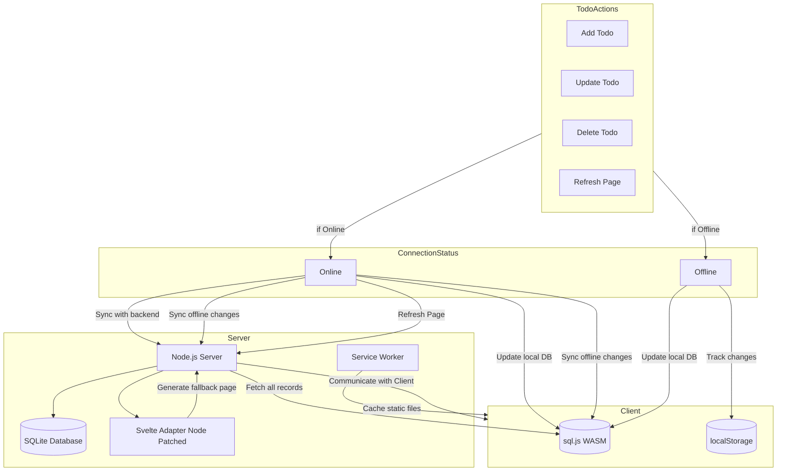
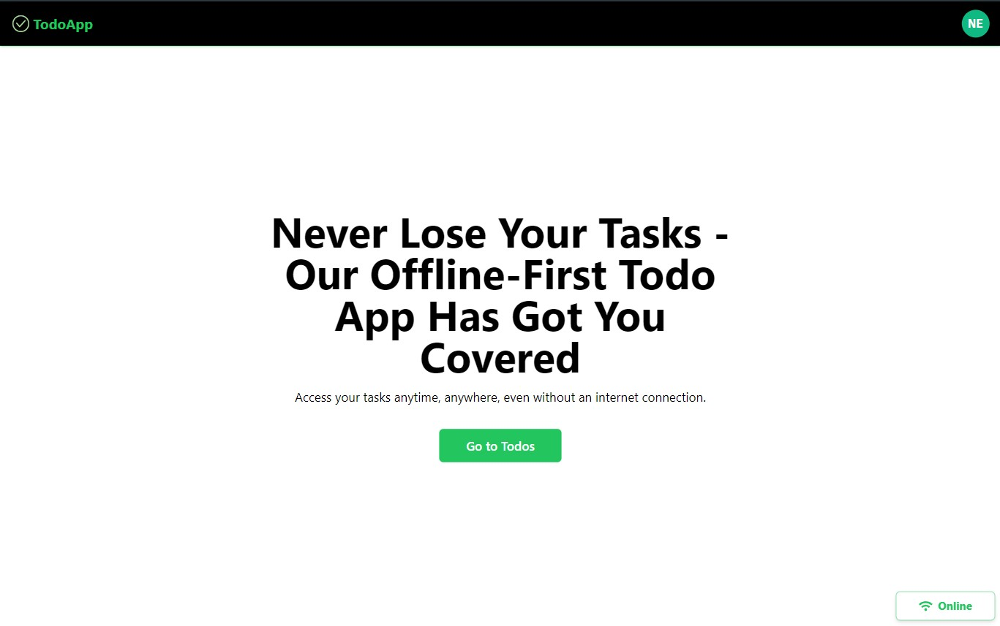
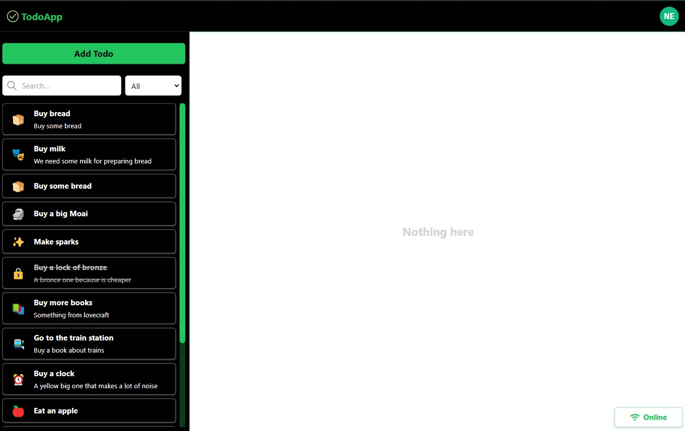

# Offline-First Todo App

A simple offline-first todo app made with Svelte 5 and Sqlite.

## How it works?

On the server we use a `sqlite` database to store the todos, on the client we also use `sql.js` which is a version of
sqlite compiled to `WASM`.

All the routes are prerendered and all the static files are cache and serve from a `service worker` when offline.

We also run a node server within the same app, I patched the `@sveltejs/adapter-node` so it can generate a fallback page that is used for dynamic routes.

- While the user have connection (online) each time a todo is added, updated or deleted, we make a call to the backend to create/update/delete that todo,
  and also update the local database.

- When the user have not connection (offline) we only write in the local database and also keep track of the added/updated/delete (currently in `localStorage`),
  after the user recover the connection we make a request to the backend with all the records that where affected while offline to synchronize with the backend.

- Each time the page refresh if the user is online we get all the records from the backend and recreate the local database.

## Screenshots

